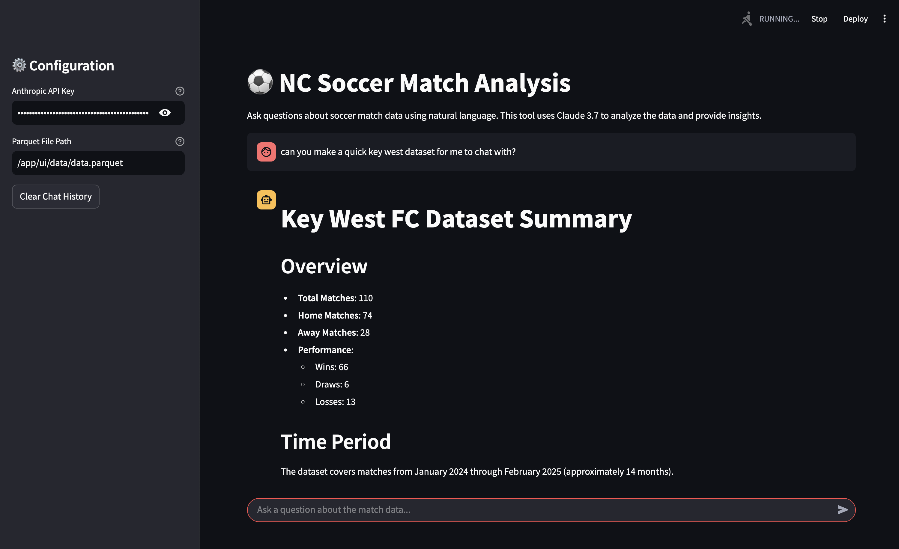

# DuckDB Soccer Analysis Agent with Claude 3.7



An agentic approach to query soccer match data using Claude 3.7's tool calling capabilities. This project allows you to ask natural language questions about soccer match data stored in parquet files and get accurate SQL-based answers.

## Features

- **Natural Language to SQL**: Translate questions like "how did Key West FC do in 2025 Feb" into proper SQL queries
- **Team Name Fuzzy Matching**: Automatically matches ambiguous team names to their database equivalents
- **Schema Understanding**: Automatically extracts and understands parquet file schema
- **SQL Validation**: Validates generated SQL before execution to prevent errors
- **Recursive Tool Calling**: Advanced pipeline that allows Claude to use multiple tools in sequence
- **Interactive UI**: Streamlit-based user interface for easy interaction
- **Dataset Management**: Create and select team-specific datasets for faster, context-efficient analysis

## Architecture

The project uses an intelligent agent architecture with the following components:

- **Claude 3.7 API**: Powers the reasoning and natural language understanding
- **DuckDB**: Fast in-process SQL engine for querying parquet files
- **Tools Framework**: A comprehensive set of tools for Claude to interact with the database
- **Analysis Module**: Enhanced data analysis capabilities for soccer match data
- **Streamlit UI**: Web interface for interactive querying
- **Dataset Context Mode**: Alternative lightweight mode for faster responses with pre-loaded data

## Setup

This project uses [uv](https://github.com/astral-sh/uv) for Python package management and virtual environments.

### Prerequisites

- Python 3.8 or higher
- uv (`pip install uv`)
- An Anthropic API key for Claude 3.7

### Installation

1. Clone the repository:
   ```bash
   git clone <repository-url>
   cd ncsoccer-agent
   ```

2. Set up the environment:
   ```bash
   uv venv
   uv pip install -e .
   ```

3. Set your Anthropic API key:
   ```bash
   export ANTHROPIC_API_KEY=your_api_key_here
   ```

4. Download the sample data:
   ```bash
   make refresh-data
   ```

## Usage

### Command Line Interface

Run the query agent with a natural language question:

```bash
uv run cli.py query "How did Key West FC do in February 2025?"
```

### Streamlit UI

Launch the web interface for interactive querying:

```bash
cd ui && python -m streamlit run app.py
```

#### Dataset Mode

In the Streamlit UI, you can use the Dataset Management feature in the sidebar to:

1. **Create New Datasets**: Generate LLM-optimized datasets for specific teams
2. **Select Existing Datasets**: Choose from previously created datasets
3. **Chat with Dataset Context**: Ask questions directly about the selected dataset

This feature provides:
- **Faster Responses**: Without the overhead of running SQL queries each time
- **Focused Analysis**: Interactions are specifically about the loaded dataset
- **Simplified Context**: Using a smaller, targeted context window for more efficient processing
- **Smart Query Routing**: Intelligently uses the dataset context for most questions, only switching to full SQL queries when necessary for global analysis

The system intelligently determines when a question is about the loaded dataset versus when it requires broader analysis. Questions like "what was the biggest win?" will use the loaded dataset, while questions like "how does this compare to all teams historically?" will use the full database with SQL queries.

### Using Dataset Mode in Streamlit UI

1. In the sidebar, enter dataset instructions like "Create a 2025 Key West dataset" or "Internazionale matches in January"
2. Click "Create Dataset" to generate an optimized dataset with time period filtering
3. The dataset will load automatically and be displayed in the chat
4. Ask questions about the dataset: "How many games did they win?" or "What was their biggest victory?"
5. For statistical questions, the system will automatically query the full database
6. For simple questions, you'll get faster responses using the pre-loaded dataset context

## Project Structure

- `cli.py`: Command-line interface for the agent
- `analysis/`: Core analysis functionality
  - `agent.py`: The main agent implementation with recursive tool calling
  - `database.py`: DuckDB-specific analysis tools
  - `tools/`: Tool implementations for Claude 3.7
    - `claude_tools.py`: Tool definitions and implementations
- `ui/`: Streamlit-based web interface
  - `app.py`: Main Streamlit application with dataset management
  - `streamlit_agent.py`: Streamlit-compatible agent implementation
  - `data/`: Directory for storing team-specific datasets

## Examples

### Team Performance Analysis

```bash
uv run cli.py query "Compare the performance of Key West FC and BDE in February 2025"
```

### Finding Match Results

```bash
uv run cli.py query "Show me all matches where Key West FC scored more than 5 goals"
```

### Creating Team Datasets

```bash
uv run cli.py team "Key West FC"
```

## Contributing

Contributions are welcome! Please feel free to submit a Pull Request.

## License

[MIT License](LICENSE)